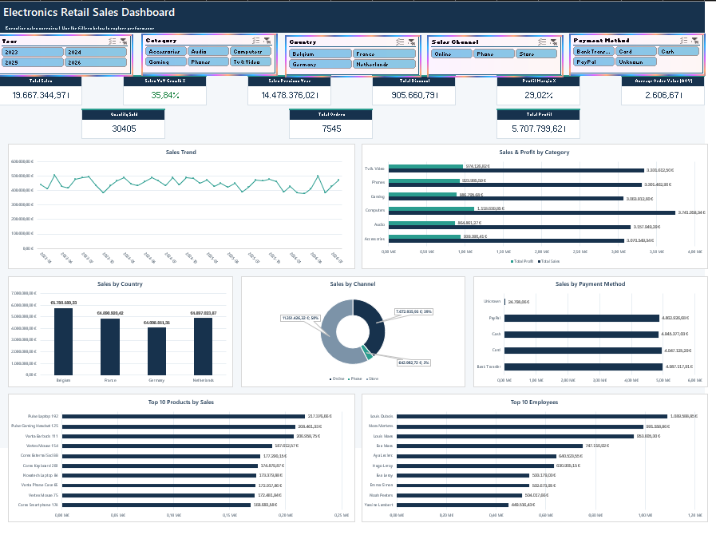

# Electronics Retail Sales Analysis

## Project Overview

This project analyzes retail sales data for an electronics retailer using Excel.

The objective was to transform raw data from multiple tables into a structured analytical model and build an interactive dashboard to monitor sales performance, profitability and key business indicators.

## Tools & Skills

- Excel
- Power Query
- Power Pivot
- DAX
- Data Cleaning & Transformation
- Data Modeling
- Star Schema
- PivotTables & PivotCharts
- Interactive Dashboard Design

## Data Preparation

The original dataset contained multiple tables including:

- Customers
- Employees
- Orders
- Order Lines
- Products
- Stores

Power Query was used to clean and transform the data before loading it into the Excel Data Model.

Key transformations included:

- Data type corrections
- Handling missing values
- Text standardization
- Duplicate checks
- Creation of calculated sales, cost and profit fields
- Creation of a dedicated Date dimension

## Data Model

A star schema was created in Power Pivot with `Fact_Sales` as the central fact table.

Dimension tables:

- Dim_Date
- Dim_Product
- Dim_Customers
- Dim_Stores
- Dim_Employees

The fact table operates at order-line level.

## DAX Measures

Several measures were created to analyze business performance, including:

- Total Sales
- Total Profit
- Total Orders
- Quantity Sold
- Average Order Value (AOV)
- Profit Margin %
- Total Discount
- Sales Previous Year
- Sales YoY Growth %

## Dashboard

The interactive dashboard provides analysis of:

- Sales trends over time
- Sales and profit by product category
- Sales by country
- Sales by channel
- Sales by payment method
- Top 10 products by sales
- Top 10 employees by sales

Interactive slicers allow the dashboard to be filtered by:

- Year
- Category
- Country
- Sales Channel
- Payment Method

## Key KPIs

The dashboard tracks:

- Total Sales
- Total Profit
- Total Orders
- Quantity Sold
- Average Order Value
- Profit Margin
- Year-over-Year Sales Growth
- Previous Year Sales
- Total Discounts

## Files

- `Electronics_Retail_Analysis.xlsx` — Complete Excel analysis and interactive dashboard
- `dashboard.png` — Dashboard preview
